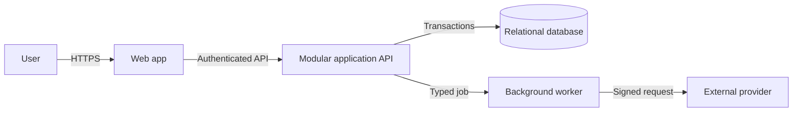

# Design Vibe Architecture

An open-source Codex Skill that turns a product idea or an existing vibe-coded repository into a buildable, reviewable software architecture plan.

It is designed for developers who can direct coding agents but still need a reliable way to decide system boundaries, frontend/backend responsibilities, data models, authorization, LLM safety, deployment, and production evolution.

## What it produces

- Product scope, non-goals, assumptions, and measurable quality targets
- One proportionate architecture recommendation with explicit trade-offs
- Frontend, backend, API, module, and integration responsibilities
- Database entities, relationships, constraints, indexes, lifecycle, and migration plan
- Authentication, session, object-level authorization, audit, security, and privacy design
- Deterministic boundaries, tools, approvals, evals, traces, and fallback for LLM features
- Release increments, tests, observability, rollout, rollback, and maintenance plan
- Architecture Decision Records and revisit triggers
- A copy-ready implementation brief for the next coding agent
- Mermaid system architecture, ER, and critical-sequence diagrams

## Design principles

1. Start with product boundaries, not framework names.
2. Prefer a modular monolith and one relational source of truth until evidence justifies more complexity.
3. Keep identity, authorization, money, destructive actions, and persistence rules deterministic.
4. Treat generated code, model output, retrieval results, and external callbacks as untrusted until validated.
5. Make every risky release observable and reversible.
6. Record when each architecture decision should be revisited.

## Install

Clone this repository:

```bash
git clone https://github.com/XiaoshengChen/design-vibe-architecture.git
```

Copy the Skill into Codex's personal skills directory:

```bash
cp -R design-vibe-architecture/skills/design-vibe-architecture ~/.codex/skills/
```

Restart Codex or begin a new task so the Skill catalog refreshes.

## Use

Invoke it explicitly:

```text
Use $design-vibe-architecture to turn my idea for a family meal-planning app into a project plan and architecture diagrams.
```

It also triggers on architecture-planning requests such as:

```text
Review this vibe-coded SaaS repository and tell me whether its auth, database, and deployment architecture are safe for production.
```

```text
Design a small AI research assistant. Show the deterministic boundary, tool permissions, evaluation plan, data model, and Mermaid diagrams.
```

```text
用 $design-vibe-architecture 把我的产品想法整理成可交给编码模型执行的项目方案，并画出架构图、数据关系图和关键流程图。
```

## Example architecture diagram

The generated plan uses portable Mermaid diagrams that stay consistent with the written component responsibilities:



## Validate a generated plan

The included validator checks required sections, unresolved placeholders, minimum diagrams, authorization language, revisit triggers, and rollback coverage:

```bash
python3 skills/design-vibe-architecture/scripts/validate_architecture_plan.py path/to/architecture-plan.md
```

For machine-readable results:

```bash
python3 skills/design-vibe-architecture/scripts/validate_architecture_plan.py --json path/to/architecture-plan.md
```

## Repository layout

```text
skills/design-vibe-architecture/
├── SKILL.md
├── agents/openai.yaml
├── references/
│   ├── architecture-method.md
│   └── output-contract.md
└── scripts/
    └── validate_architecture_plan.py
```

## License

MIT. See [LICENSE](LICENSE).

进一步学习：[《架构师的地图：给非程序员的互动式软件架构课》](https://chenxs.me/works/software-architecture-field-guide/)
