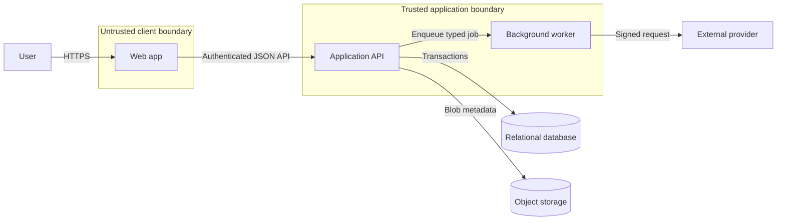
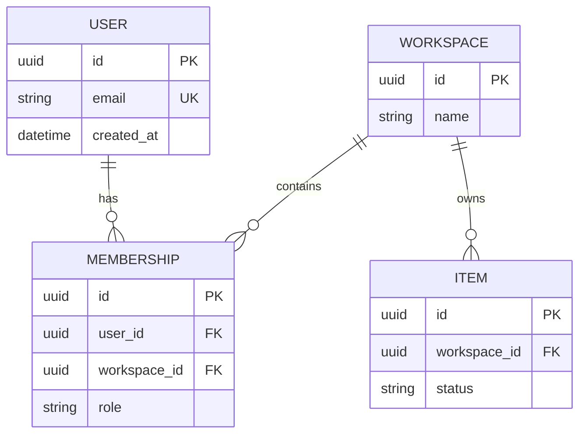
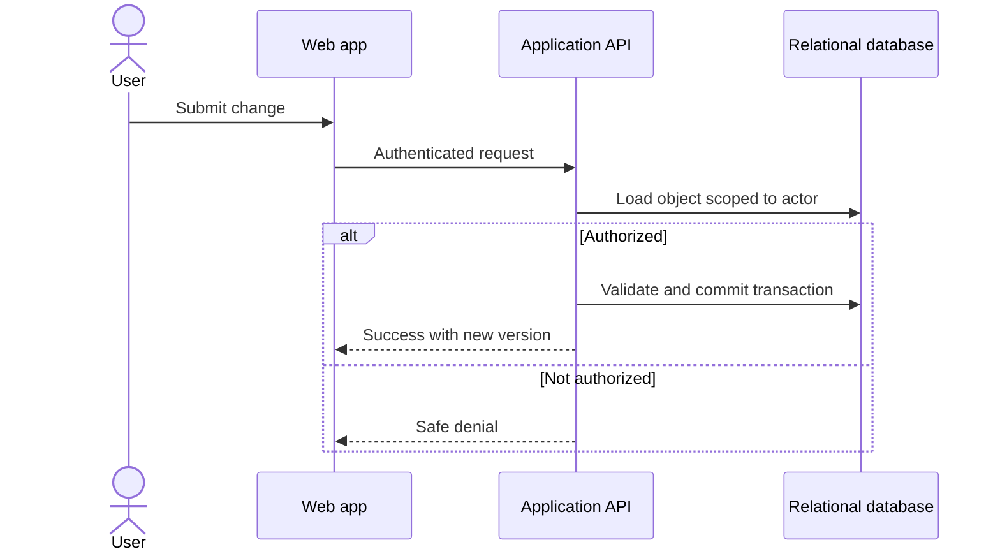

# Architecture plan output contract

Use this contract for a complete project proposal. Match the user's language, but preserve the numbered section order so humans and validation tools can navigate the document.

## Contents

1. Required sections
2. Diagram rules
3. Decision tables
4. Implementation handoff
5. Compact mode

## 1. Required sections

### 1. Executive Summary / 项目摘要

State the target user, problem, critical journey, recommended architecture, and why it is proportionate in no more than eight sentences.

### 2. Scope and Assumptions / 范围与假设

Include:

- Goals.
- Explicit non-goals.
- Known facts.
- Working assumptions with validation methods.
- Open questions that materially change the design.
- Constraints: team, time, budget, region, existing systems, vendors, or compliance.

### 3. Quality Targets / 质量目标

Use a table:

| Attribute | Scenario | Evidence | Initial target | Revisit trigger |
| --- | --- | --- | --- | --- |

Do not fabricate numerical targets. Label proposed numbers as assumptions.

### 4. Recommended Architecture / 推荐架构

Explain the architecture style and deployment shape. Include one responsibility table:

| Component | Responsibility | Trust boundary | Data owned | Failure behavior | Scaling trigger |
| --- | --- | --- | --- | --- | --- |

Then include the system architecture diagram.

### 5. Data Design / 数据设计

Describe:

- Source of truth.
- Entities, ownership, keys, relationships, constraints, and indexes.
- Tenant or user isolation.
- Deletion, retention, export, backup, and restore.
- Migration order for the first release and future compatible changes.

Include an ER diagram for relational state. If there is no relational state, write `ER diagram omitted:` followed by a reason.

### 6. API and Critical Flow / API 与关键流程

List the smallest set of contracts needed for the critical journey. For each include actor, authorization rule, request, response, errors, idempotency, and transaction boundary.

Include a sequence diagram for the riskiest or most important journey, including at least one failure or denial path.

### 7. Identity, Security, and Privacy / 身份、安全与隐私

Cover authentication, sessions, account recovery, roles or attributes, object-level authorization, secrets, audit events, abuse controls, sensitive data, retention, and threat boundaries. State what the client is never trusted to decide.

### 8. LLM Boundary / LLM 边界

If AI is used, define deterministic responsibilities, model responsibilities, structured input/output, tool permissions, human approvals, prompt-injection defenses, evaluation set, trace fields, cost and latency budgets, fallback, and versioning.

If AI is not used, state `LLM boundary: not applicable` rather than adding an unnecessary model component.

### 9. Production and Evolution / 生产与演进

Cover environments, CI checks, secrets, feature flags, migrations, deployment order, observability, SLO or user-outcome signals, alerts, incident response, rollback, restore drills, and cleanup.

### 10. Implementation Plan / 实施计划

Use vertical increments, not layer-only phases:

| Increment | User-visible outcome | Changes | Acceptance evidence | Release and rollback |
| --- | --- | --- | --- | --- |

Each increment should leave the system coherent and testable.

### 11. Architecture Decisions / 架构决策

For every consequential choice provide:

- Decision.
- Context.
- Options considered.
- Consequences and trade-offs.
- Evidence or assumption.
- Revisit trigger.

### 12. Risks and Review Triggers / 风险与复审条件

Rank risks by likelihood and impact. Give one detection signal and one mitigation for each. Separate present risks from speculative future concerns.

### 13. Coding-Agent Brief / 编码代理任务书

Finish with a copy-ready brief containing:

- Objective and non-goals.
- Files or modules in scope when known.
- Contracts and invariants.
- Data and authorization rules.
- Required tests and commands.
- Migration and release order.
- Evidence to report.
- Conditions that require stopping and asking the user.

## 2. Diagram rules

Use fenced Mermaid blocks. Keep the diagram and prose consistent.

### System architecture

Prefer a readable flowchart with trust boundaries and named protocols:

### Data model

Use relationship labels and key fields:

### Critical sequence

Show authorization and a failure path:

Rules:

- Use ASCII identifiers and quoted human-readable labels.
- Keep diagrams focused; split diagrams that exceed roughly 12 primary nodes.
- Do not use color as the only meaning.
- Show external actors and trust boundaries.
- Label protocols or important data movement.
- Show the source of truth.
- Do not include a component absent from the responsibility table.
- Prefer a separate deployment diagram only when deployment topology materially affects the decision.

## 3. Decision tables

Use tables when they make mappings or trade-offs easier to verify. Avoid long technology catalogs. A stack recommendation should connect each choice to responsibility, constraint, downside, and exit trigger:

| Concern | Recommended choice | Reason | Downside | Exit trigger |
| --- | --- | --- | --- | --- |

Include cost as an operating characteristic: free-tier assumptions, fixed services, usage-driven services, major cost drivers, and measurement. Do not promise exact prices without current provider evidence.

## 4. Implementation handoff

The final plan must enable another coding agent to begin without rediscovering the architecture. Ensure it can answer:

- What is the first vertical slice?
- Which module owns each rule and entity?
- Which data must never be trusted from the client or model?
- What does success look like in tests and runtime signals?
- In what order do schema, backend, frontend, and flags deploy?
- How can the change be disabled, rolled back, or repaired?
- What unresolved decision requires human input?

## 5. Compact mode

Use compact mode by default for a new small product or a one-to-three-person team. Target roughly 1,200–2,500 words plus diagrams. Keep all 13 sections, but use one to three bullets each, one responsibility table, and the three minimum diagrams. Combine repeated facts into tables and reference earlier decisions instead of restating them. Do not omit security, data lifecycle, production, or revisit triggers merely to be brief.

Use extended mode only when the user explicitly asks for a detailed document or when an existing system, regulated domain, financial or medical workflow, multi-region topology, hard availability target, or complex migration needs deeper evidence. State why extended mode is being used.
